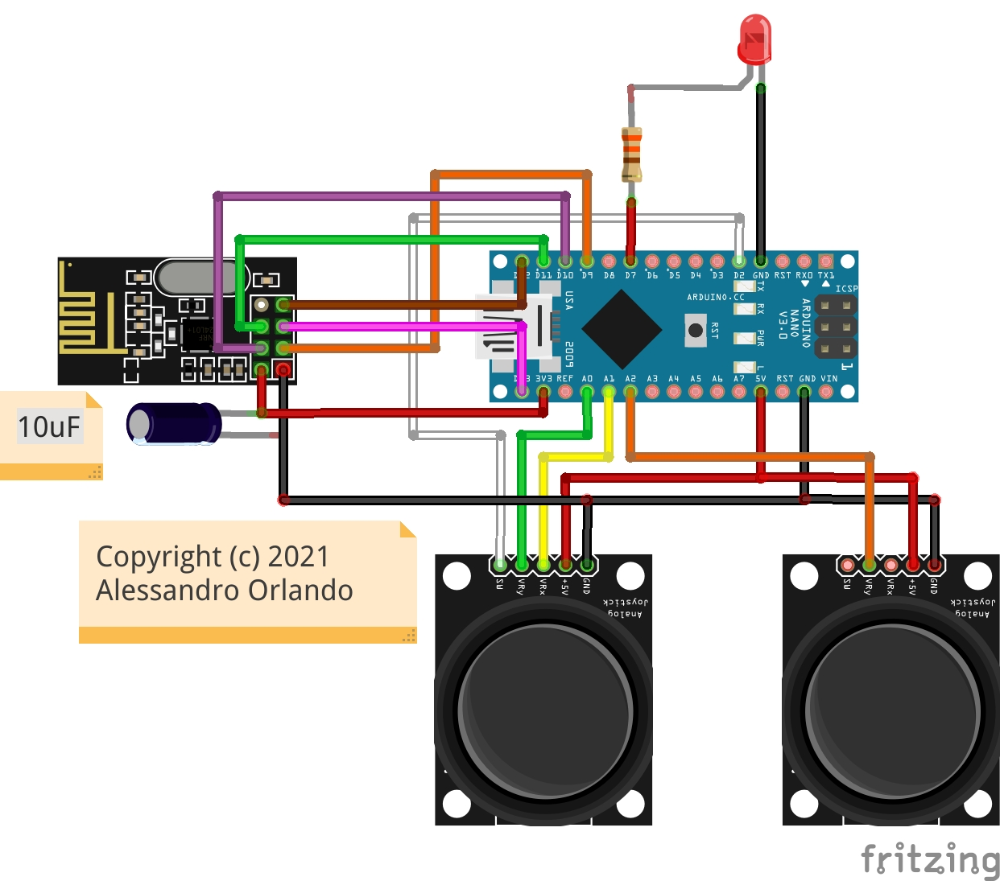

# TX-3-STEP-NANO-24L01

Simple RC transmitter built on an Arduino Nano and an nRF24L01 radio module. It reads three analog joystick axes and one push-button, then broadcasts a compact data packet over 2.4 GHz to a matching receiver that drives a 3-axis motorized slider with pan and tilt.

## How it works

Each joystick axis is read via ADC (0–1023), mapped to a speed range of 0–1000, and split into a deadzone around the center. Outside the deadzone the axis produces a signed speed value (negative for one direction, positive for the other) and a movement flag. The enable button toggles motor power on and off with hardware debounce, and its state is reflected on a status LED.

All six motion fields plus the enable flag are packed into a 10-byte struct and written to the radio pipe every loop iteration. The `__attribute__((packed))` directive prevents compiler padding, keeping the payload within the nRF24L01 32-byte limit and ensuring binary compatibility with the receiver.

## Hardware

| Component | Pin |
|---|---|
| nRF24L01 CE | D9 |
| nRF24L01 CS | D10 |
| Enable button | D2 |
| Enable LED | D7 |
| Joystick X | A0 |
| Joystick Y | A1 |
| Joystick Z | A2 |

## Dependencies

- [RF24](https://github.com/nRF24/RF24)
- [Bounce2](https://github.com/thomasfredericks/Bounce2)

## License

MIT — see source file header for full text.
